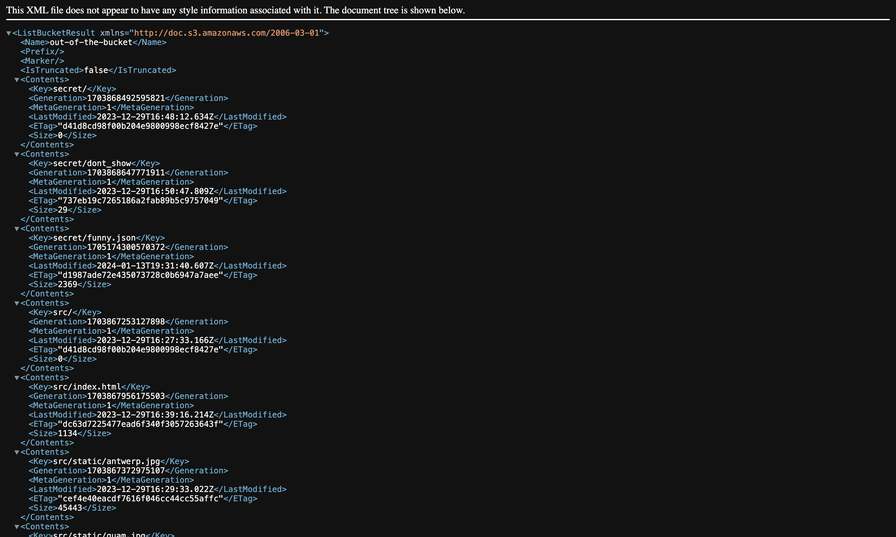
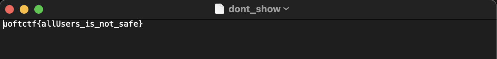

# misc/Out of the Bucket
`Points: 100`

### Description
```
Check out my flag website!

Author: windex

https://storage.googleapis.com/out-of-the-bucket/src/index.html
```

## Solve

Let's go to the root of the bucket



You can see the `secret/*` path right? `secret/dont_show` is the flag!


ez~