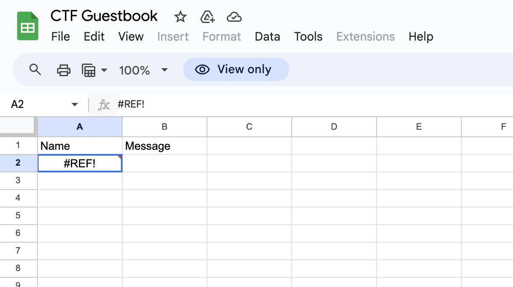
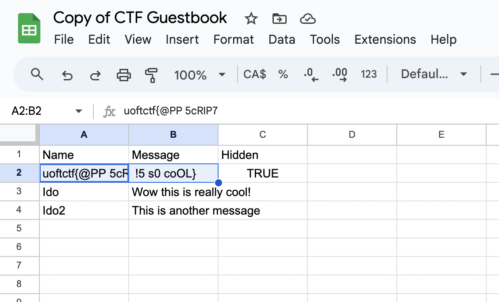

# web/Guestbook
`Points: 442`

### Description
```
I made this cool guestbook for the CTF. Please sign it.

Author: Ido
```

#### index.html
```html
<!DOCTYPE html>
<html lang="en">
<head>
    <meta charset="UTF-8">
    <title>My Guestbook</title>
    <script async=false defer=false>
        fetch("https://script.google.com/macros/s/AKfycbyX5Y5MkBLDO4JrB67pTTx7A6JI_ajT-3aBXC1UvnurQjbLYmDJjUfPTne-cyGsKxY8/exec?sheetId=1PGFh37vMWFrdOnIoItnxiGAkIqSxlJDiDyklp9OVtoQ").then(x=>x.json()).then(x=>{
            x.slice(x.length-11).forEach(entry =>{
                const el = document.createElement("li");
                el.innerText = entry.Name + " - " + entry.Message
                document.getElementById("entries").appendChild(el)
            })
            document.getElementById("loading")?.remove();
        })
    </script>
</head>
<body>
<h1>
    Hi! I made this guestbook for my site, please sign it.
</h1>
<iframe name="dummyframe" id="dummyframe" style="display: none;"></iframe>
<h3 style="margin: 0">Last 10 user entries in the guestbook:</h3>
<p id="loading" style="margin: 0">Loading...</p>
<ul id="entries" style="margin: 0">
</ul>

<h3>Sign the guestbook:</h3>
<form method="POST" action="https://script.google.com/macros/s/AKfycbyX5Y5MkBLDO4JrB67pTTx7A6JI_ajT-3aBXC1UvnurQjbLYmDJjUfPTne-cyGsKxY8/exec?sheetId=1PGFh37vMWFrdOnIoItnxiGAkIqSxlJDiDyklp9OVtoQ">
  <input id="name" name="name" type="text" placeholder="Name" required>
  <input id="message" name="message" type="text" placeholder="Message" required>
  <button type="submit">Send</button>
</form>
</body>
</html>
```

You can see the `sheetId` from the URL. I just try to go to the [https://docs.google.com/spreadsheets/d/:sheetId/edit](https://docs.google.com/spreadsheets/d/1PGFh37vMWFrdOnIoItnxiGAkIqSxlJDiDyklp9OVtoQ/edit)



I got the sheet, but I can't access the hidden sheet. I just tried to make a copy. then I can access the hidden sheet. So, I got the flag.



ez!